# tensorflow-pix2pix
Tensorflow implementation of pix2pix [1] for various datasets.

* you can download datasets: https://people.eecs.berkeley.edu/~tinghuiz/projects/pix2pix/datasets/
* you can see more information for network architecture and training details in https://arxiv.org/pdf/1611.07004.pdf

## dataset
* cityscapes
  * 2,975 training images, 200 train epochs, 1 batch size, inverse order: True
* facades
  * 400 training images, 200 train epochs, 1 batch size, inverse order: True
* maps
  * 1,096 training images, 200 train epochs, 1 batch size, inverse order: True
* edges2shoes
  * 50k training images, 15 train epochs, 4 batch size, inverse order: False
* edges2handbags
  * 137k training images, 15 train epochs, 4 batch size, inverse order: False

## Resutls
### maps
* facades after 200 epochs
<table align='center'>
<tr align='center'>
<td> Input </td>
<td> Output </td>
<td> Ground truth </td>
</tr>
<tr>
<td>
<td>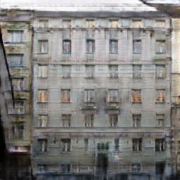
<td>
</tr>
<tr>
<td>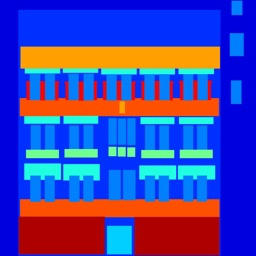
<td>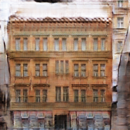
<td>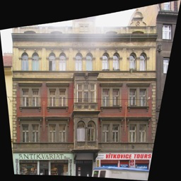
</tr>
<tr>
<td>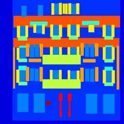
<td>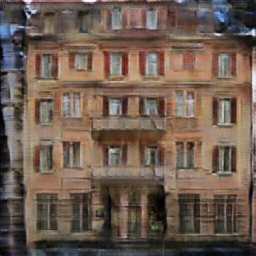
<td>
</tr>
</table>

* Generate animation for fixed inputs
  * First column: input, second column: output, third column: ground truth

* Learning time
  * Avg. per epoch: 54.19 sec; Total 200 epochs: 11,339.61 sec
  
### maps
* maps after 200 epochs
<table align='center'>
<tr align='center'>
<td> Input </td>
<td> Output </td>
<td> Ground truth </td>
</tr>
<tr>
<td>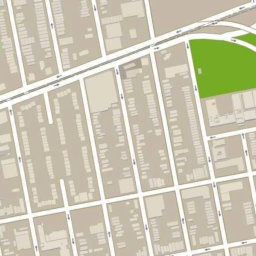
<td>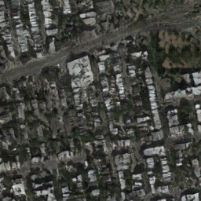
<td>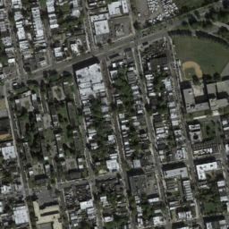
</tr>
<tr>
<td>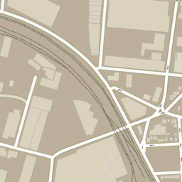
<td>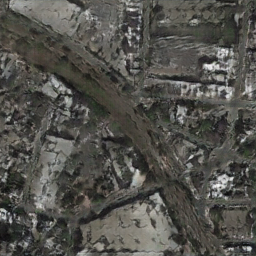
<td>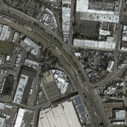
</tr>
<tr>
<td>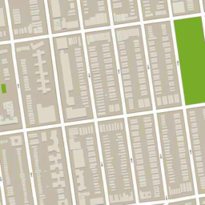
<td>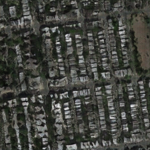
<td>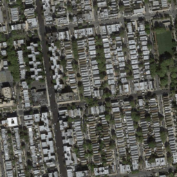
</tr>
</table>

* Generate animation for fixed inputs
  * First column: input, second column: output, third column: ground truth

* Learning time
  * Avg. per epoch: 205.08 sec; Total 200 epochs: 41,622.29 sec
  
## Development Environment

* Windows 7
* GTX1080 ti
* cuda 8.0
* Python 3.5.3
* tensorflow-gpu 1.2.1
* numpy 1.13.1
* matplotlib 2.0.2
* imageio 2.2.0

## Reference

[1] Isola, Phillip, et al. "Image-to-image translation with conditional adversarial networks." arXiv preprint arXiv:1611.07004 (2016).

(Full paper: https://arxiv.org/pdf/1611.07004.pdf)
